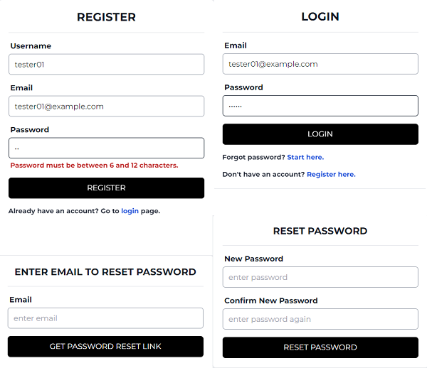

## __1. Create app and add packages__
- ### `$ npx create-next-app@latest ksr01-next-auth` with `eslint` and `tailwindcss`
- ### `$ npm i axios bcryptjs jsonwebtoken mongoose nodemailer react-hot-toast react-icons`
- ### `$ npm i -D eslint-config-prettier prettier`
- ### `$ npm i -D prettier-plugin-tailwindcss` (sort tailwind classes)

## __2. Notes__
- ### Environment variables:
  - MONGODB_URI=
  - JWT_SECRET=
  - TOKEN_NAME=
  - DOMAIN=
  - AUTH_EMAIL=
  - AUTH_PASSWORD=

- ### Filenames `*-v1.tsx` are used up to Video 8

## __3. Font__
- ### `@import url('https://fonts.googleapis.com/css2?family=Montserrat:wght@400;700&display=swap');`
- ### Add to `tailwind.config.js`:
  ```js
  extend: {
        fontFamily:{
          'primary': ['Montserrat']
        }
      },
  ```

## __4. Add scripts to `package.json`__
```json
"lint": "eslint src/**/*.{js,jsx,ts,tsx,json}",
"format": "prettier --write src/**/*.{js,jsx,ts,tsx,css,md,json,scss} --config ./.prettierrc"
```

## __5. Add `.eslintrc.json`__

```json
{
    "root": true,
    "env": {
        "browser": true,
        "es2021": true
    },
    "extends": [
        "next",
        "prettier"
    ],
    "parserOptions": {
        "ecmaVersion": "latest",
        "sourceType": "module"
    },
    "settings": {"react": {"version": "detect"}},
    "plugins": [],
    "rules": {}
}
```

## __6. Add `.prettierrc`__

```json
{
  "singleQuote": true,
  "trailingComma": "none",
  "tabWidth": 2,
  "semi": false,
  "jsxSingleQuote": true,
  "bracketSpacing": false,
  "bracketSameLine": false,
  "arrowParens": "avoid",
  "proseWrap": "always",
  "singleAttributePerLine": true,
  "printWidth": 120,
  "plugins": ["prettier-plugin-tailwindcss"]
}
```
